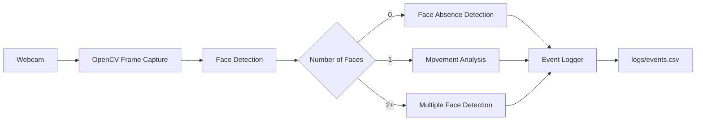
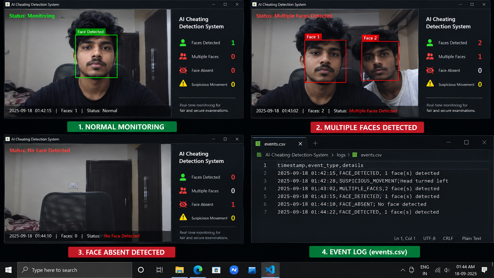

# AI-Based Cheating Detection System

> Real-time computer vision prototype for identifying potentially suspicious events during examinations.

[](https://www.python.org/)
[](https://opencv.org/)
[](LICENSE)

## Overview

This project is a lightweight computer-vision-based examination monitoring prototype. It uses a webcam and OpenCV to monitor a candidate's camera feed and record events that may require human review.

The system focuses on three basic signals:

- Face absence
- Multiple faces
- Significant movement of the detected face position

The goal is to demonstrate how real-time video processing, event detection, and security-oriented logging can be combined into an examination-monitoring workflow.

> **Important:** The system does not determine that cheating has occurred. It produces potential-suspicion events that require human review.

## Architecture



## Detection Workflow

```text
Webcam
   |
   v
Frame Capture
   |
   v
Face Detection
   |
   +-------------------+
   |                   |
   v                   v
No Face            Multiple Faces
   |                   |
   v                   v
Absence Event     Multiple-Face Event
   |
   +-------------------+
             |
             v
     Single Face Present
             |
             v
     Movement Analysis
             |
             v
       Event Logger
             |
             v
       CSV Report
```

## Features

### 1. Real-Time Monitoring

Captures frames from the default webcam and processes them continuously.

### 2. Face Detection

Uses OpenCV's Haar Cascade classifier to detect faces in each frame.

### 3. Multiple-Face Detection

Flags frames where more than one face is detected.

### 4. Face-Absence Detection

Records an event when no face is detected continuously for the configured time period.

### 5. Movement Analysis

Tracks the center of a detected face and flags significant movement beyond the configured threshold.

### 6. Event Logging

Events are timestamped and written to:

```text
logs/events.csv
```

Example:

```text
timestamp,event,detail
2026-09-18T10:30:12,Multiple Faces,2
2026-09-18T10:31:04,Face Absent,0
2026-09-18T10:32:18,Head Movement,1
```

## Technology Stack

| Technology | Purpose |
|---|---|
| Python | Application development |
| OpenCV | Computer vision and webcam processing |
| NumPy | Numerical/image-processing dependency |
| PyTest | Basic automated testing |
| CSV | Event logging |

## Project Structure

```text
AI-Cheating-Detection-System/
│
├── main.py
├── requirements.txt
├── README.md
├── LICENSE
├── .gitignore
│
├── src/
│   ├── __init__.py
│   ├── config.py
│   ├── face_detection.py
│   ├── behavior_detection.py
│   └── event_logger.py
│
├── tests/
│   └── test_detection.py
│
├── screenshots/
│   ├── monitoring-demo.png
│   └── README.md
│
├── logs/
│   └── .gitkeep
│
└── docs/
    └── architecture.md
```

## Screenshots

The following screenshot demonstrates the system's monitoring interface, including normal face detection, multiple-face detection, face absence detection, and event logging.



## Installation

### 1. Clone the repository

```bash
git clone https://github.com/krishnadevjs/AI-Cheating-Detection-System.git
cd AI-Cheating-Detection-System
```

### 2. Create a virtual environment

Windows:

```powershell
python -m venv .venv
.venv\Scripts\activate
```

Linux/macOS:

```bash
python3 -m venv .venv
source .venv/bin/activate
```

### 3. Install dependencies

```bash
pip install -r requirements.txt
```

## Usage

Start the application:

```bash
python main.py
```

The default webcam will open.

Press:

```text
Q
```

to stop monitoring.

Detected events are saved automatically to:

```text
logs/events.csv
```

## Configuration

Detection parameters are stored in `src/config.py`.

```python
ABSENCE_SECONDS = 3
MOVEMENT_THRESHOLD = 35
EVENT_COOLDOWN_SECONDS = 5
```

These values can be adjusted for different camera environments.

## Testing

Run:

```bash
pytest
```

The tests verify core behavior-detection logic such as multiple-face events and normal single-face operation.

## Security and Privacy Considerations

An examination-monitoring system processes potentially sensitive visual and behavioral information.

A production implementation should consider:

- Explicit user consent
- Data minimization
- Secure storage
- Access control
- Encryption
- Retention and deletion policies
- Audit logging
- False-positive review
- Applicable privacy and education regulations

This prototype intentionally does not upload video to a remote service.

## Limitations

This is a portfolio and learning project, not a production proctoring platform.

Potential sources of false positives include:

- Poor lighting
- Camera positioning
- Occlusion
- Multiple people legitimately appearing in frame
- Face-detection errors
- Natural head movement

The system should therefore be treated as an event-generation tool rather than an automated decision-maker.

## Future Improvements

- MediaPipe or YOLO-based detection
- Improved head-pose estimation
- Gaze estimation
- Candidate identity verification
- Object detection for prohibited items
- Web-based monitoring dashboard
- Database-backed event storage
- Encrypted evidence management
- Role-based access control
- Configurable examination policies
- Better automated testing

## Author

**Krishnadev JS**

Cybersecurity | Network Security | Ethical Hacking | Computer Vision

GitHub: https://github.com/krishnadevjs

## License

This project is released under the MIT License. See [LICENSE](LICENSE).
