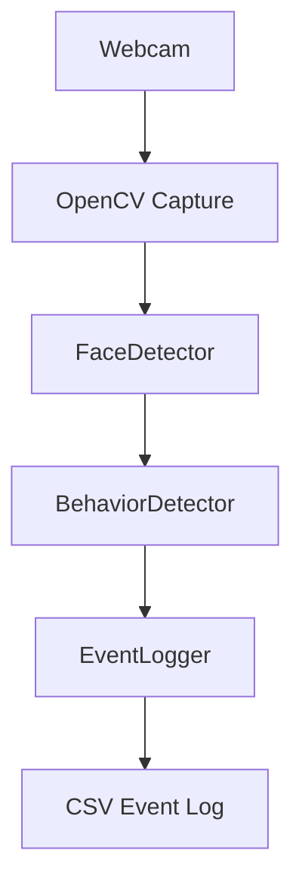

# Architecture

The system follows a simple real-time processing pipeline.



## Components

### `main.py`

Application entry point. It captures webcam frames, passes them through the detection modules, displays status information, and writes detected events.

### `src/face_detection.py`

Contains the OpenCV Haar Cascade face detector.

### `src/behavior_detection.py`

Contains event-generation logic for:

- face absence
- multiple faces
- significant movement

### `src/event_logger.py`

Writes timestamped events to a CSV file.

### `src/config.py`

Contains configurable thresholds and cooldown values.

## Data Flow

```text
Camera Frame
     |
     v
Face Bounding Boxes
     |
     v
Behavior Analysis
     |
     v
Event
     |
     v
Timestamp + Detail
     |
     v
events.csv
```
